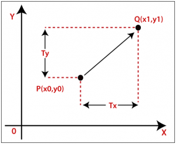
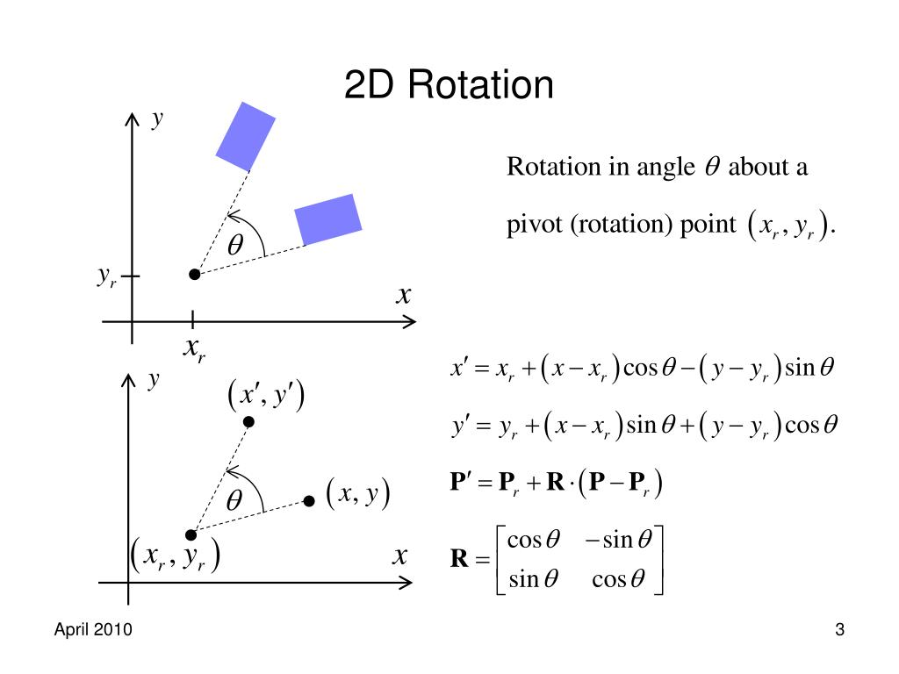
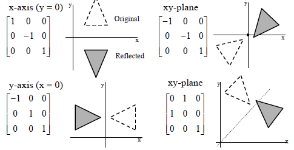
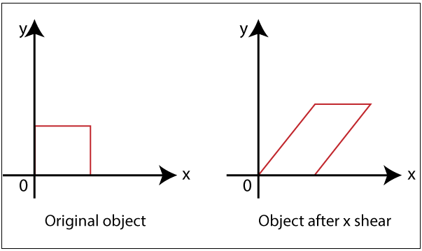
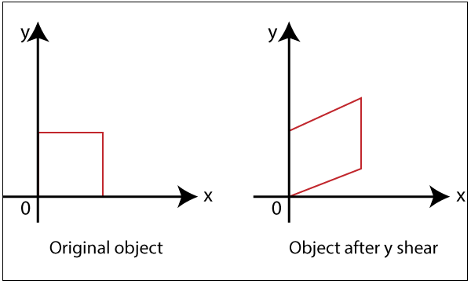

# 2 Dimensional transformations in computer graphics 🍂

---
## 2D Translation

2D translation is the process of moving an object in a plane by a given distance in the x and y direction. The translation matrix is given by:

$$\begin{bmatrix} 1 & 0 & tx \\ 0 & 1 & ty \\ 0 & 0 & 1 \end{bmatrix}$$
where tx and ty are the distances to be moved in the x and y direction respectively.


```C
    #include <stdio.h>
    #include <graphics.h>

    int main() 
    {
        int gd = DETECT, gm;
        int x1, y1, x2, y2, tx, ty;

        initgraph(&gd, &gm, "C:\\Program Files (x86)\\Colorado\\cs1300\\bgi");

        printf("Enter the staring Co-ordinates : ");
        scanf("%d %d", &x1, &y1);

        printf("Enter the end Co-ordinates : ");
        scanf("%d %d", &x2, &y2);

        printf("Enter the translation Co-ordinates : ");
        scanf("%d %d", &tx, &ty);

        rectangle(x1, y1, x2, y2);
        rectangle(x1 + tx, y1 + ty, x2 + tx, y2 + ty);

        return EXIT_SUCCESS;
    }

```
---

## 2D Scaling

2D scaling is the process of changing the size of an object in a plane by a given factor in the x and y direction. The scaling matrix is given by:

$$\begin{bmatrix} sx & 0 & 0 \\ 0 & sy & 0 \\ 0 & 0 & 1 \end{bmatrix}$$
where sx and sy are the scaling factors in the x and y direction respectively.


```C
    #include <stdio.h>
    #include <graphics.h>

    int main() 
    {
        int gd = DETECT, gm;
        int x1, y1, x2, y2, sx, sy;

        initgraph(&gd, &gm, "C:\\Program Files (x86)\\Colorado\\cs1300\\bgi");

        printf("Enter the staring Co-ordinates : ");
        scanf("%d %d", &x1, &y1);

        printf("Enter the end Co-ordinates : ");
        scanf("%d %d", &x2, &y2);

        printf("Enter the scaling Co-ordinates : ");
        scanf("%d %d", &sx, &sy);

        rectangle(x1, y1, x2, y2);
        rectangle(x1 * sx, y1 * sy, x2 * sx, y2 * sy);

        return EXIT_SUCCESS;
    }
```
---

## 2D Rotation

2D rotation is the process of rotating an object in a plane by a given angle. The rotation matrix is given by:



```C
    #include <stdio.h>
    #include <graphics.h>
    #include <math.h>

    int main() 
    {
        int gd = DETECT, gm;
        int x1, y1, x2, y2, x3, y3, x4, y4, angle;

        initgraph(&gd, &gm, "C:\\Program Files (x86)\\Colorado\\cs1300\\bgi");

        printf("Enter the staring Co-ordinates : ");
        scanf("%d %d", &x1, &y1);

        printf("Enter the end Co-ordinates : ");
        scanf("%d %d", &x2, &y2);

        printf("Enter the rotation angle : ");
        scanf("%d", &angle);

        x3 = x1 * cos(angle) - y1 * sin(angle);
        y3 = x1 * sin(angle) + y1 * cos(angle);

        x4 = x2 * cos(angle) - y2 * sin(angle);
        y4 = x2 * sin(angle) + y2 * cos(angle);

        rectangle(x1, y1, x2, y2);
        rectangle(x3, y3, x4, y4);

        return EXIT_SUCCESS;
    }
```
---

## 2D Reflection

2D reflection is the process of reflecting an object in a plane by a given line. The reflection matrix is given by:



```C
    #include <stdio.h>
    #include <graphics.h>

    int main() 
    {
        int gd = DETECT, gm;
        int x1, y1, x2, y2, x3, y3, x4, y4;

        initgraph(&gd, &gm, "C:\\Program Files (x86)\\Colorado\\cs1300\\bgi");

        printf("Enter the staring Co-ordinates : ");
        scanf("%d %d", &x1, &y1);

        printf("Enter the end Co-ordinates : ");
        scanf("%d %d", &x2, &y2);

        x3 = x1;
        y3 = -y1;

        x4 = x2;
        y4 = -y2;

        rectangle(x1, y1, x2, y2);
        rectangle(x3, y3, x4, y4);

        return EXIT_SUCCESS;
    }
```
---

## 2D Shearing

2D shearing is the process of shearing an object in a plane by a given factor in the x and y direction. The shearing matrix is given by:

$$\begin{bmatrix} 1 & shx & 0 \\ shy & 1 & 0 \\ 0 & 0 & 1 \end{bmatrix}$$
where shx and shy are the shearing factors in the x and y direction respectively.




```C
    #include <stdio.h>
    #include <graphics.h>

    int main() 
    {
        int gd = DETECT, gm;
        int x1, y1, x2, y2, shx, shy;

        initgraph(&gd, &gm, "C:\\Program Files (x86)\\Colorado\\cs1300\\bgi");

        printf("Enter the staring Co-ordinates : ");
        scanf("%d %d", &x1, &y1);

        printf("Enter the end Co-ordinates : ");
        scanf("%d %d", &x2, &y2);

        printf("Enter the shearing Co-ordinates : ");
        scanf("%d %d", &shx, &shy);

        rectangle(x1, y1, x2, y2);
        rectangle(x1 + shx * y1, y1 + shy * x1, x2 + shx * y2, y2 + shy * x2);

        return EXIT_SUCCESS;
    }
```
---
