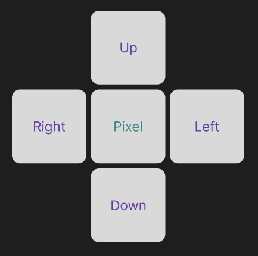
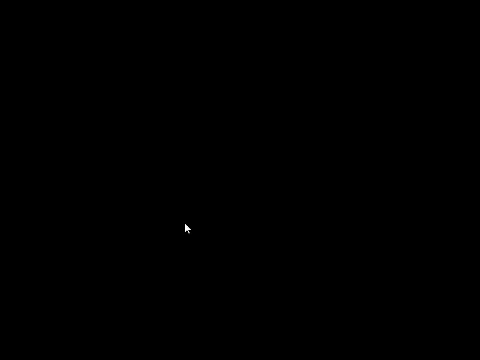

# Boundry Fill Algorithm

## Algorithm 

FIlling the polygon means highlighting all the pixels which lie inside the polygon with any colour other than background.

In this procedure, the polygon's edges are first created, and then, beginning at any place inside the polygon, we evaluate the nearby pixel to see if the boundary pixel has been reached.
When boundary pixels are not reached, those pixels are highlighted and the operation is repeated until they are. 

### 4 - Connected
Every pixel in the region may be reached by combining moves in only four directions (left, right, up, and down) in 4-connected. 

```c
void boundryFill(int x, int y, int f_color, int b_color) {
    if (getpixel(x, y) == b_color && getpixel(x, y) != f_color) {
        putpixel(x, y, f_color);
        boundryFill(x + 1, y, f_color, b_color); // left
        boundryFill(x, y + 1, f_color, b_color); // up
        boundryFill(x - 1, y, f_color, b_color); // right
        boundryFill(x, y - 1, f_color, b_color); // down
    }
}
```


## Example 1

The following example uses boundry fill algorithm to fill the rectangle.

```c
#include <stdio.h>
#include <graphics.h>

void boundryFill(int x, int y, int f_color, int b_color) {
    if (getpixel(x, y) == b_color && getpixel(x, y) != f_color) {
        putpixel(x, y, f_color);
        boundryFill(x + 1, y, f_color, b_color); // left
        boundryFill(x, y + 1, f_color, b_color); // up
        boundryFill(x - 1, y, f_color, b_color); // right
        boundryFill(x, y - 1, f_color, b_color); // down
    }
}

int main() {
    int gd = DETECT, gm;
    int x1, y1, x2, y2;

    initgraph(&gd, &gm, "C:\\Program Files (x86)\\Colorado\\cs1300\\bgi");

    printf("Enter the staring Co-ordinates : ");
    scanf("%d %d", &x1, &y1);

    printf("Enter the end Co-ordinates : ");
    scanf("%d %d", &x2, &y2);

    rectangle(x1, y1, x2, y2);
    boundryFill((x1 + x2) / 2, (y1 + y2) / 2, WHITE, BLACK);

    return EXIT_SUCCESS;
}
```

## Output



---

## Example 2

The following example uses boundry fill algorithm to fill the circle.

```c
// C Implementation for Boundary Filling Algorithm
#include <graphics.h>

// Function for 4 connected Pixels
void boundaryFill4(int x, int y, int fill_color,int boundary_color)
{
	if(getpixel(x, y) != boundary_color &&
	getpixel(x, y) != fill_color)
	{
		putpixel(x, y, fill_color);
		boundaryFill4(x + 1, y, fill_color, boundary_color);
		boundaryFill4(x, y + 1, fill_color, boundary_color);
		boundaryFill4(x - 1, y, fill_color, boundary_color);
		boundaryFill4(x, y - 1, fill_color, boundary_color);
	}
}

//driver code
int main()
{

	int gd = DETECT, gm;
	initgraph(&gd, &gm, "");

	int x = 250, y = 200, radius = 50;

	// circle function
	circle(x, y, radius);

	boundaryFill4(x, y, 6, 15);

	delay(10000);

	getch();

	closegraph();

	return 0;
}
```
